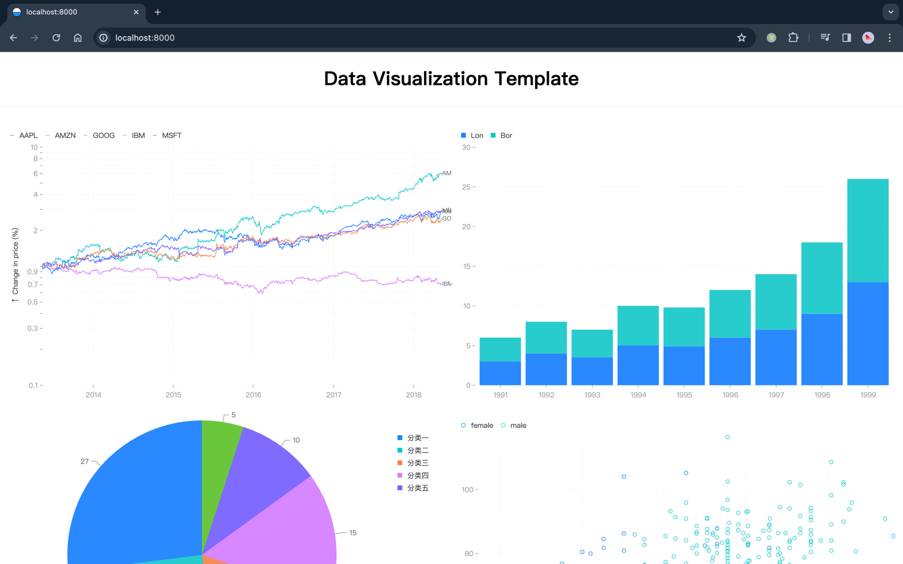

# Data Visualization Template

📈 A quick template for data visualization.



[>> Click me to try now <<](https://research.dovolopor.com/data-visualization-template/)

## Getting Start

Click `use template` in the upper right corner to create a new project.

```shell
git clone https://github.com/dovolopor-research/data-visualization-template.git

cd data-visualization-template

# node 18 is required!
pnpm install

npm run dev
# open http://localhost:8000
```

## Run in docker

> if the site deploy in sub route, please add base and publicPath in .umirc.ts.
> e.g. `{ base: "/sub/", publicPath: "/sub/"}`

```shell
docker build -t data-visualization-template:1.0.0 .

docker run -d --restart=always \
  --name data-visualization-template -p 8000:80 \
  data-visualization-template:1.0.0
```

## Reference

- [Ant Design](https://ant-design.antgroup.com/index-cn)
- [Ant Design Charts](https://ant-design-charts-next.antgroup.com/)

## License

[](./LICENSE)